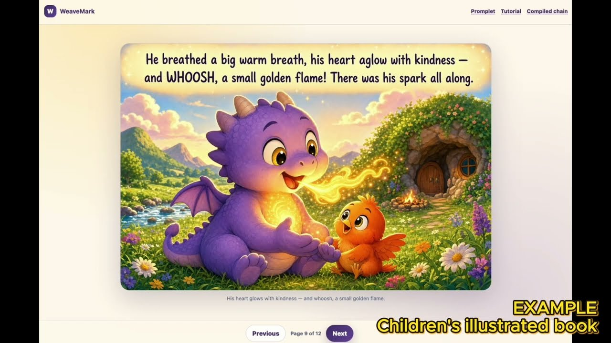
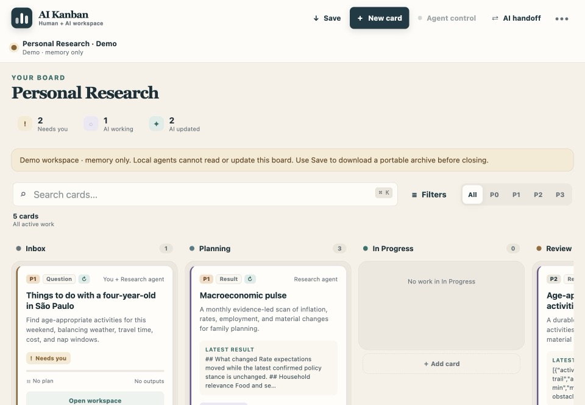
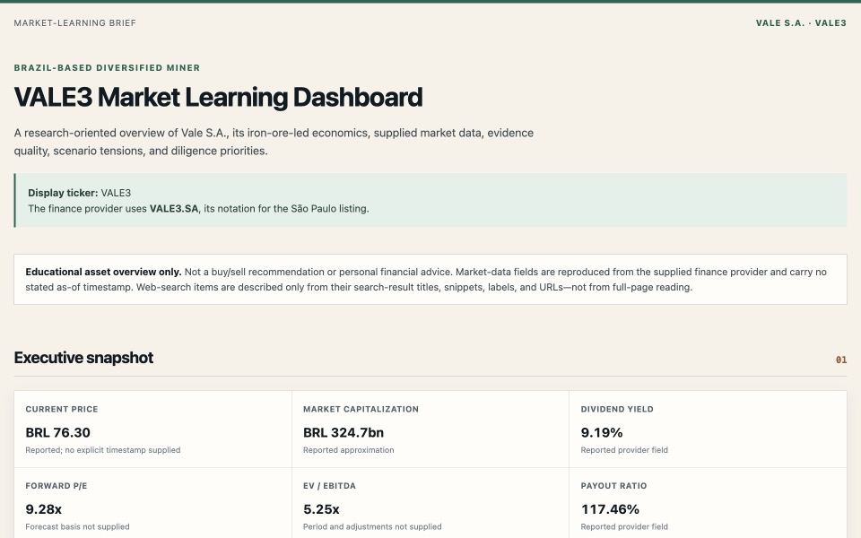
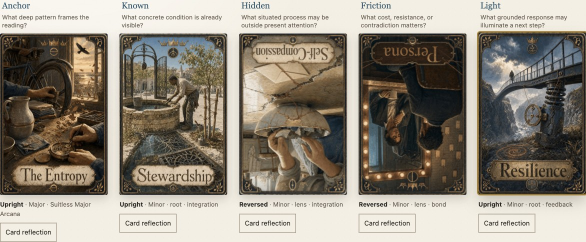

<p align="center">
  
</p>

# WeaveMark

**A specification language for readable, reusable, and composable prompts.**

[](https://pypi.org/project/weavemark/)
[](https://pypi.org/project/weavemark/)
[](https://github.com/paulosalem/weavemark/actions/workflows/ci.yml)
[](LICENSE)

[Website](https://paulosalem.github.io/weavemark/) · [Tutorials](https://paulosalem.github.io/weavemark/docs/tutorial.html) · [Manual](docs/manual.md) · [Language reference](docs/language-reference.md) · [PyPI](https://pypi.org/project/weavemark/)

> [!WARNING]
> WeaveMark is highly experimental. Its notation, Processor behavior, examples, and public interfaces are still evolving. Expect rough edges and breaking changes.

**WeaveMark** is a small **specification language** for prompts. Write your prompt (or **promplet**) as readable Markdown plus special directives, *woven* into it. These include reuse (`@refine`), control flow (`@match`), polishing (`@polish`), dynamic clarifications (`@ask`), and many others. Then
use the **WeaveMark Processor** to: **compile** a concrete prompt, which can then be fed to an AI assistant or programming agent; or, optionally, actually **execute** it directly, independently of any other tool.

Compilation is intentionally hybrid: variables, branches, imports, output contracts, and validation are structural; semantic directives such as `@refine` are realized by an LLM. Execution, when requested, relies on predefined engines that follow well-established LLM patterns, as well as user-specified companion programs.

> 💡 **Language is a tool for thought.** Prompts formulate ways of thinking, and WeaveMark makes their linguistic and cognitive structure explicit and composable. See [the principles](https://paulosalem.github.io/weavemark/docs/principles.html) for what follows from this.

[](https://youtu.be/gHJ4O_QGWJ4)

## 🖼️ See what it produced

| Illustrated storybook | AI Kanban | Market report | Arcana |
|---|---|---|---|
| [](https://paulosalem.github.io/weavemark/demos/orion-storybook/) | [](https://paulosalem.github.io/weavemark/demos/ai-kanban/) | [](https://paulosalem.github.io/weavemark/examples/saved-artifact-workflows/market-snapshot/outputs/market-dashboard.html) | [](https://paulosalem.github.io/weavemark/demos/arcana/) |
| A twelve-page story authored, illustrated page by page, and packaged to HTML/PDF. [Source](https://github.com/paulosalem/weavemark/blob/main/promplets/catalog/executable/childrens-book.weavemark.md?plain=1) · [Tutorial](https://paulosalem.github.io/weavemark/docs/tutorial-illustrated.html) | A concise software promplet compiled into a detailed contract and implemented as a backend-free browser app. [Source](https://github.com/paulosalem/weavemark/blob/main/promplets/catalog/standalone/ai-kanban-board.weavemark.md?plain=1) · [Compiled spec](https://github.com/paulosalem/weavemark/blob/main/outputs/implementations/ai-kanban-browser/compiled-spec.md) · [Tutorial](https://paulosalem.github.io/weavemark/docs/tutorial-implement.html) | Finance data and bounded search evidence executed through a strict graph, then packaged as a standalone report. [Source](https://github.com/paulosalem/weavemark/blob/main/promplets/catalog/executable/market-snapshot.weavemark.md?plain=1) · [Trace](https://github.com/paulosalem/weavemark/blob/main/examples/saved-artifact-workflows/market-snapshot/outputs/execution-trace.md) · [Tutorial](https://paulosalem.github.io/weavemark/docs/tutorial-executable.html) | A 55-card archetypal reflection game generated in two stages: deck artifacts, then a private browser reading experience. [Cards](https://github.com/paulosalem/weavemark/blob/main/promplets/catalog/arcana/cards.weavemark.md?plain=1) · [App](https://github.com/paulosalem/weavemark/blob/main/promplets/catalog/arcana/app.weavemark.md?plain=1) · [Compiled spec](examples/saved-artifact-workflows/arcana/outputs/arcana-app-spec.md) |

These are checked-in outputs, not mockups. The examples retain their source promplets, compiled plans or specifications, run artifacts, and tests.

## ⚡ Try it yourself

Replay two recorded examples without an API key or network call. `--verbose` shows
validation and statistics; Market Snapshot restores and opens its final HTML.

```bash
pip install weavemark

weavemark library market-snapshot --replay --verbose --open
weavemark library ai-kanban-board --replay --verbose --open
```

Replay validates source, inputs, prompts, schema, modules, calls, and artifacts,
then restores outputs without calling effects. VALE3: 11,002 input, 0 cached,
20,728 output, $0.3384. AI Kanban: 133,913 input, 133,833 cached, 13,372 output, $0.1874. Both cost nothing to replay.

For a fresh semantic compilation and a real finance/search execution, install the example integrations and configure a model provider. The market data and web search need no additional keys.

```bash
pip install "weavemark[examples]"
export OPENAI_API_KEY="..."

weavemark library market-snapshot \
  --var provider_ticker=VALE3.SA \
  --var display_ticker=VALE3 \
  --var "company_name=Vale S.A." \
  --var "research_focus=iron ore demand, capital allocation, and material risks" \
  --run --verbose \
  --output-dir market-report \
  --open
```

WeaveMark compiles the promplet, runs the finance and search effects as a strict dependency graph,
writes `market-report/market-dashboard.html`, and opens it. Change the ticker variables for any
asset you follow. The finance helper is ordinary Python, so WeaveMark asks once before importing it.

This is a real effectful run, not a template expansion. Ours took about three
minutes and $0.34 of `gpt-5.6-terra` — the default tested across every bundled example; `--model` picks another.
You pay that once, not per use: the compiled prompt is an ordinary file you can
commit and review. Furthermore, LLM API responses are cached by default, so even recompiling should avoid adding cost, provided inputs and selected models are the same.

Promplets conventionally use `.weavemark.md`. With the provider configured above, save this tested
[language-plan source](promplets/tutorials/language-learning-goal-plan.weavemark.md) as `language-plan.weavemark.md`:

```markdown
@use weavemark.std.planning.goals exposing goal_plan
# Language-learning plan
@goal_plan goal: "Reach conversational Spanish" domain: "learning" horizon: "9 months" starting_point: "I know basic phrases" constraints: "20 minutes per weekday" assumption_source: "No external lookup needed"
```

```bash
weavemark language-plan.weavemark.md --batch-only --output language-plan.md
```

Change the goal and constraints to make it yours. Continue with
[Your first promplet](https://paulosalem.github.io/weavemark/docs/tutorial.html) or
[Spec to app](https://paulosalem.github.io/weavemark/docs/tutorial-implement.html). Use only trusted promplets for effectful runs.

## 📖 The source stays readable

This abridged AI Kanban source composes reusable architecture instead of repeating it.
Read the [full promplet](promplets/catalog/standalone/ai-kanban-board.weavemark.md) and
the [compiled specification](outputs/implementations/ai-kanban-browser/compiled-spec.md) it produces:

```markdown
@refine module:weavemark.domains.programming.foundations.software_spec
@refine module:weavemark.domains.programming.stacks.browser_static_esmodules
@refine module:weavemark.domains.programming.types.browser_folder_backed_webapp
@refine module:weavemark.domains.programming.modules.browser_agent_workspace_coordination

# AI Kanban — Browser Workspace for Human-AI Work

This implementation-ready specification defines a polished static JavaScript
application for GitHub Pages with no backend.
```

The reusable modules carry file lifecycle, worker-owned SQLite, compatibility,
security, accessibility, and AI-handoff rules. The entrypoint stays focused on the product.

Notice what is *absent*: no slots, placeholders, or include points. `@refine` states
*what* to bring in, and the model works out where it belongs — merging obligations,
ordering sections, and adapting wording. Reuse costs one line instead of a refactor.

## 🧠 Why use a language?

- **Reuse without templating.** Shared constraints live in one promplet, and
  semantic transformation weaves them into each dependent source — no include
  points to author, no scaffolding to maintain. Every dependent picks up the new
  guidance on its next compile; the quality of each realization remains model-
  and run-dependent.
- **Readable intent and control flow.** Variables, `@if`, `@match`, modules, assertions, and
  output contracts stay visible beside ordinary Markdown.
- **Executable plans.** Promplets can select reflection, chain, self-consistency,
  tree-of-thought, functional, collaborative, or FSLM execution, and persist
  images, reports, traces, prompt packs, packaged HTML/PDF, or a specification.
- **Inspectability.** Source, compiled artifacts, bindings, execution metadata,
  and traces can be reviewed independently.

## 🧩 The building blocks

A promplet is ordinary Markdown annotated with a set of directives. Most are interpreted by an LLM, with some local structural support, to generate the final prompt. Some highlights:

| Construct | What it does |
|---|---|
| `@refine` | Weaves another promplet's meaning into this one |
| `@expand` `@style` `@summarize` | Elaborates, restyles, or condenses content in place |
| `@iterate` | Lets the Processor revisit and improve a transformation  |
| `@ask` | Pauses for missing human context before compiling |
| `@{var}` `@if` `@match` | Inputs and controlled variation from one source |
| `@use` `@module` `@define` | Imports modules and defines reusable pieces and macros |
| `@assert` `@output` | Content obligations and strict output contracts  |
| `@bind` `@tool` | Attaches trusted Python companions and tools |
| `@execute` | Picks reflection, chain, tree-of-thought, functional, FSLM… |
| `@emit` `@package` | Writes files; packages an artifact into HTML or PDF |

Generated text, code, and images remain model- and run-dependent. WeaveMark does
not claim formal verification or deterministic prompt quality; rather, it provides a
durable language surface around generative behavior. Every directive is specified
in the [language reference](docs/language-reference.md).

## 🔐 Installation and safety

```bash
pip install weavemark          # normal installation
pip install -e ".[dev]"        # source development
```

Protections are enabled by default for local reads/writes, downloads, Python, and
external processes. They reduce common risks but are **not an operating-system
sandbox**. Do not run untrusted promplets; `--no-protections` disables these
checks for one invocation. [SECURITY.md](SECURITY.md) has the full threat model,
and the [manual](docs/manual.md#10-protections) has the policy keys.

WeaveMark depends on [ellements](https://pypi.org/project/ellements/), a library
of LLM building blocks I also maintain, which is why it is a required dependency
rather than a third-party one. Full-resolution comic and storybook PNG/PDF
artifacts use Git LFS; run `git lfs pull` in a clone to fetch the original media.

## 🗂️ More examples

| Example | What it demonstrates |
|---|---|
| [Illustrated stories](https://paulosalem.github.io/weavemark/docs/tutorial-illustrated.html) | Multimodal inputs, image outputs, reflection, repeated page chains, HTML/PDF packaging. |
| [AI Kanban](https://paulosalem.github.io/weavemark/docs/tutorial-implement.html) | Reusable software architecture, concise source, compiled contract, programming-agent implementation. |
| [Market report](https://paulosalem.github.io/weavemark/docs/tutorial-executable.html) | Module-owned bindings, effect graph, grounded synthesis, execution trace, semantic HTML packaging. |
| [Arcana](https://paulosalem.github.io/weavemark/demos/arcana/) | Two-stage deck generation and application compilation, 55 illustrated cards, private browser readings, and optional AI reflection. |
| [Knowledge Cards](https://paulosalem.github.io/weavemark/demos/knowledge-cards/) | A mobile-first static app with manifest-discovered content packs and local state. |
| [Recurring topic monitor](promplets/catalog/executable/recurring-topic-monitor.weavemark.md) | Bounded search/news/crawl tools with event memory and material-change detection. |
| [Reasoning strategies](studies/runtime-studies/reasoning-strategies) | Reflection, self-consistency, and tree-of-thought promplets with their saved runs. |

The full maintained catalog is in [docs/examples.md](docs/examples.md); the 90
reusable building blocks live under [promplets/stdlib](promplets/stdlib) and
[promplets/domains](promplets/domains). To add your own, see the
[manual](docs/manual.md#8-adding-your-own-promplets).

## 🗺️ Repository structure

| Path | What you will find there |
|---|---|
| [`src/weavemark/`](src/weavemark) | The Processor: CLI, compilation, engines, packaging, safety, and terminal UI |
| [`src/weavemark/prompts/weavemark.system.md`](src/weavemark/prompts/weavemark.system.md) | The canonical semantic language and compiler contract |
| [`promplets/`](promplets) | The maintained catalog, standard library, domain modules, tutorials, and replay bundles |
| [`examples/`](examples) | Runnable workflows with their inputs, runners, and saved outputs |
| [`outputs/`](outputs) | Maintained generated applications, compiled specifications, and other showcase artifacts |
| [`docs/`](docs) | Website, tutorials, Processor manual, language reference, and EBNF grammar |
| [`tests/`](tests) | Behavioral, documentation, example, packaging, and regression contracts |
| [`weavemark.json`](weavemark.json) | Repository defaults; see the [configuration manual](docs/manual.md#9-configuration-files) for keys and precedence |
| [`scripts/`](scripts) · [`studies/`](studies) | Repository/release helpers and controlled/runtime studies |
| [`vscode-extension/`](vscode-extension) | VS Code highlighting, diagnostics, navigation, forms, and execution commands; see its [installation guide](vscode-extension/README.md#installation) |

For precise technical information, use the [Processor manual](docs/manual.md)
for setup, configuration, CLI, safety, replay, and machine integration, and the
[language reference](docs/language-reference.md) for grammar and directives.
For auditable automation, `--provenance` writes a run manifest, while
`--record-run` and `--replay-run` capture and restore an offline compilation.

Explore the [introduction](https://paulosalem.github.io/weavemark/docs/introduction.html),
[principles](https://paulosalem.github.io/weavemark/docs/principles.html),
[tutorial track](https://paulosalem.github.io/weavemark/docs/tutorial.html),
[extended notes](docs/usage-reference.md), [Python API](docs/python-api.md), and
[agent usage](docs/agent-usage.md). See also [citation](docs/citation.md),
[changelog](CHANGELOG.md), [contributing](CONTRIBUTING.md), [security](SECURITY.md), and
[development](docs/development.md).

## ❓ Frequently asked questions

### If AI assistants can already program for me, why use WeaveMark?

They reinforce each other; WeaveMark is itself built almost entirely *with* such
tools. An assistant can also *use* WeaveMark to organize its own work: instead of
regenerating sprawling ad-hoc prompts, it captures reusable intent as promplets —
personas, policies, reasoning methods, output contracts — and composes repeatable
systems from them. That also makes human–AI collaboration easier: a person reviews
just the parts that matter and leaves the rest to the model.

### Why is the language called WeaveMark and the artifacts called promplets?

**WeaveMark** is a *markup* notation for prompts. Like any markup language -- think
HTML -- it shapes the content around it, but minimally invasively, keeping the focus
on the underlying prose (usually Markdown). The name also plays on *mark*: to trace
boundaries, to assemble marked pieces toward a goal, and to take careful notice,
something worth *remarking*.

A **promplet** is one artifact written in WeaveMark: a reusable unit of prompt
composition. The name reads two ways — *prompt + -let* (a small, modular artifact,
like an applet, especially when executable) and *prompt + let* (as in "let x be…",
emphasizing binding and composition).

### Where does the promplet concept come from?

The concept grew out of my own work; I developed it during **2025** without being
aware of anyone else using a similar term. Since then I realized that a few other
people have independently explored **kindred ideas** under the similar name
*promptlet* -- each in their own way: [composable prompt artifacts](https://github.com/riddles-in-the-dark/Promptlet), a reusable [prompt snippet](https://www.josh.ing/promptlet), a [weighted segment of a Midjourney multi-prompt](https://geekycuriosity.substack.com/p/midjourney-beginners-4-making-sense), and a unit of [prompt reuse and structure](https://www.breakingrocks.net/Promptlets-The-Full-How-to-Guide-20f3a5cc79f9808a9422fae353036248).

None of these are the same as WeaveMark, but the idea of a small, named, reusable
unit of prompting seems to be in the air, and each project takes it somewhere
different. WeaveMark develops it **in its own direction**. (WeaveMark spells it
*promplet*; several of them use *promptlet*.)

### Why does the notation use `@` and indentation for scoping?

To stay as readable as Markdown as possible. `@` marks the few places WeaveMark adds a
directive, and indentation scopes its body with minimal visual noise. Most
of a promplet should still read like ordinary prose, except those that are entirely just compositions of other pieces.

### Why Markdown instead of HTML or another markup language?

Markdown is already the lingua franca of prompts: readable in plain text,
familiar to LLM users, and easy to paste anywhere. WeaveMark is not fundamentally
limited to it: the `@`-based directive style is compatible with many markup
languages, including HTML, and future versions could support those better.

### LLM-based compilation? Are you insane?

A little, of course; where would [the fun](https://en.wikipedia.org/wiki/In_Praise_of_Folly)
be otherwise? Language is the ultimate thinking tool. What if natural language
could help us design useful new languages more easily? LLMs let us try — so let's
experiment.

### Why not a template engine?

Template engines are perfect when the result shape is known exactly: substitute
this variable, include that partial verbatim. Promplets allow more *abstract*
composition, at the cost of a generative model realizing the final prompt. That
makes them more reusable and more readable. Some go further — running compiled
prompts through engines like reflection or tree-of-thought, and binding trusted
companion programs — so WeaveMark can act as a prompting engine, not only a
language.

### This is not literate programming!

Not quite: our final "program" is the prompts to be used, woven from abstract, readable
prose. Under a liberal reading of "program" as "instructions to be executed," WeaveMark
is a kind of literate programming for natural-language instructions — call it
"programmatic prompting" if you prefer.

### Is this a harness?

As much as a car is a "fuel harness".

### Don't you have an actual job and a family to feed?

Why, yes -- but what's the problem? Some people watch the World Cup.
Others spend a full waking day every week doomscrolling Instagram.
Still others feed the poor. And who sleeps before midnight anyway?
I do this. It is my idea of fun, and of contributing to the community.

## 🔍 Related work

Most prompt formats (Prompty, POML, Dotprompt) render deterministically; optimizers (DSPy, SAMMO) do let a model rewrite prompt text, but a metric over a dataset decides the result; spec-driven workflows (Spec Kit, Kiro) trust the model's judgement, yet expand a single intent and cannot import one specification into another. WeaveMark compiles with a language model and composes reusable modules by meaning. See the [full comparison of 25 projects](https://paulosalem.github.io/weavemark/docs/related-work.html).

## 📚 Citation

If WeaveMark helps your research, writing, or software work, please cite it as software ([BibTeX and APA](docs/citation.md)):

> Salem, P. (2026). *WeaveMark: A specification language for readable, reusable, and composable prompts* [Computer software]. GitHub. https://github.com/paulosalem/weavemark

## ✍️ Author

WeaveMark is authored by Dr. Paulo Salem. Learn more at
[www.paulosalem.com](https://www.paulosalem.com) or connect on
[LinkedIn](https://www.linkedin.com/in/paulosalem/).
